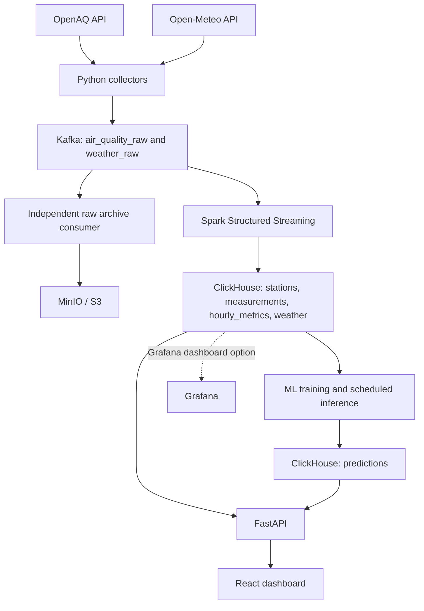

# Proposed architecture

## Data flow

OpenAQ and Open-Meteo are polled independently. Weather is associated with air-quality stations by coordinates and time. The two feeds do not require sequential API calls.

Spark validates and cleans data, handles duplicates and late records, creates hourly metrics, and calculates AQI under the chosen standard. The archive consumer reads Kafka with its own consumer group and writes raw events to MinIO/S3; it lives in `collectors/` alongside polling code.

The ML pipeline reads curated history, trains a model, and periodically writes 1–24-hour concentration forecasts to `predictions`. FastAPI reads monitoring data and predictions from ClickHouse. Training does not run inside API requests.

## Folder responsibilities

| Folder | Responsibility |
| --- | --- |
| `config/` | Station selection, polling intervals, units/AQI policy, and model settings. |
| `collectors/` | OpenAQ polling, weather polling, source progress, and the raw archive consumer. |
| `streaming/` | Spark processing and ClickHouse writes. |
| `ml/` | Dataset preparation, features, training, evaluation, and inference. |
| `api/` | FastAPI endpoints and database queries. |
| `dashboard/` | One initial UI: React using the API or Grafana querying ClickHouse. |
| `infra/` | Compose, runtime configuration, topic/bucket setup, and table SQL. |
| `tests/` | Focused unit/integration checks and fixtures. |
| `data/` | Small local samples and development outputs. |
| `docs/` | Project plan, contracts, setup instructions, and design decisions. |

Folders organize code; they do not require separate deployments or nested Python packages. Add entry points and dependency files during implementation, keeping service-specific dependencies separate where needed.

## Reliability essentials

Use stable event identities and UTC timestamps. Preserve raw data for replay and audit. Persist collector progress and Spark checkpoints, and define retry-safe writes rather than assuming database keys enforce uniqueness.

Set a documented late-data policy and support bounded reconciliation/backfill. Record aggregate coverage, units, quality flags, and the AQI standard. Forecasts include origin, target time, model version, and input freshness.

Keep source credentials in server-side environment/secrets configuration. React accesses FastAPI rather than database credentials. Production raw archives and shared model artifacts belong in object storage; local outputs need ignore rules before use.
